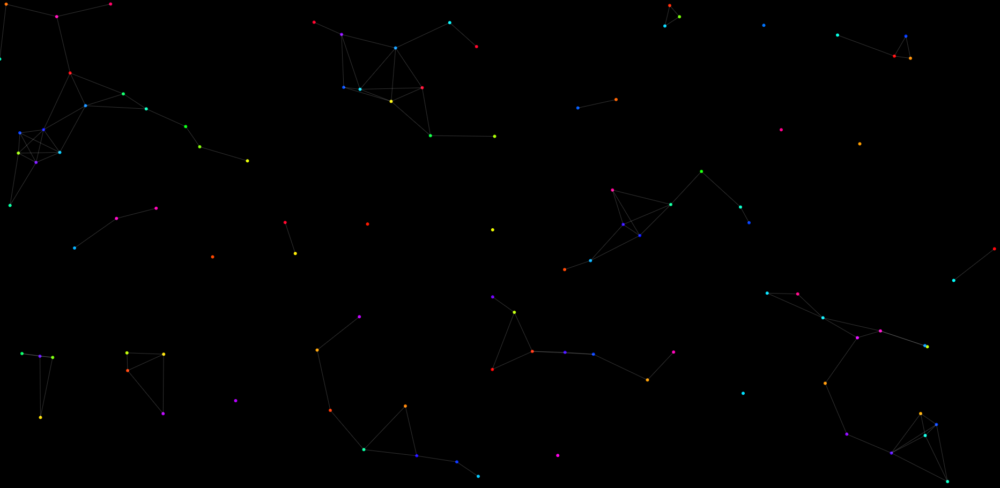

# ✨ Particle Network Animation

A visually appealing animation made with **HTML5 Canvas** and **JavaScript**.  
Particles move around the screen and connect with lines when close to each other, creating a network effect.



---

## 🚀 Features
- Black background with colorful moving particles.
- Particles connect with glowing lines when within a certain distance.
- **Interactive mouse effect**: particles are attracted to the cursor.
- Responsive (works on any screen size).
- Lightweight, pure JavaScript – no libraries required.

---

## 🛠️ Technologies Used
- **HTML5**
- **CSS3**
- **JavaScript (Canvas API)**

---

## ▶️ How to Run
1. Clone this repository:
   ```bash
   git clone https://github.com/zDR34M/Particle-Network-Animation.git
2. Open index.html in your browser.
3. Enjoy the animation ✨
